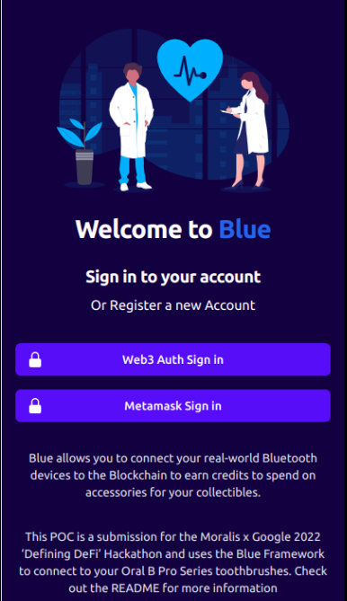
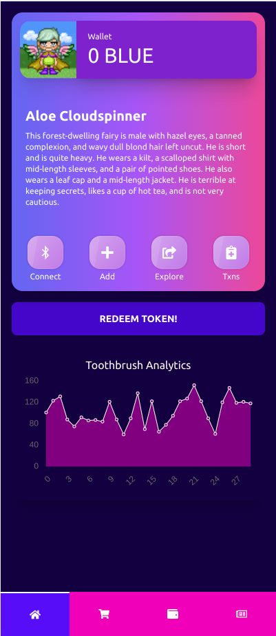
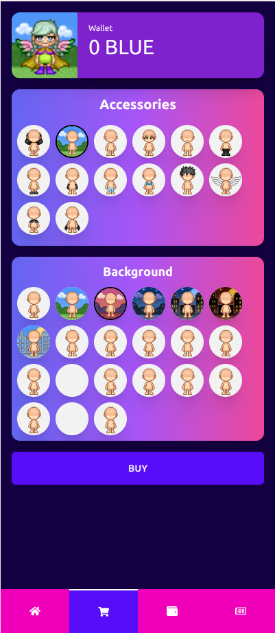
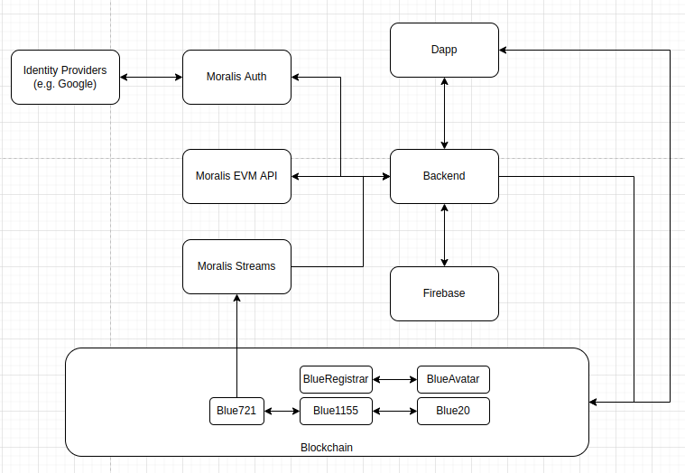
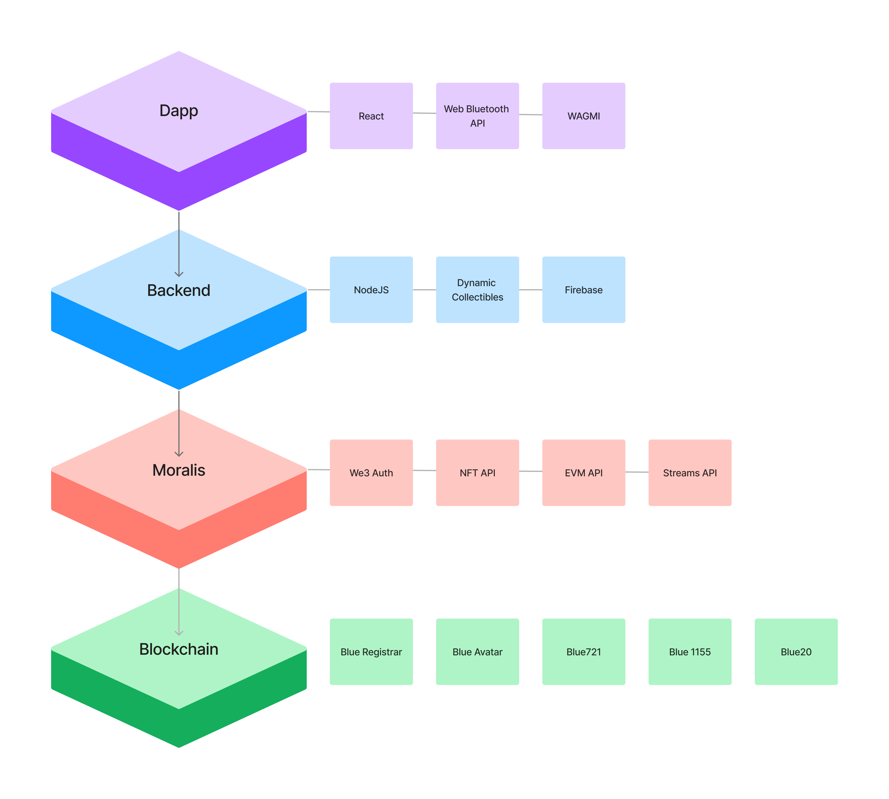

# What is Blue
Blue is a framework for organisations to integrate their bluetooth devices to the blockchain and an engagement tool for organisations to incentivise their customers through gamification, tokens, and collectibles.

Simply:
- Connect - your bluetooth device
- Collect - daily incentivised token rewards
- Engage - by using tokens to purchase accessories

## Reference Implementation
A reference implementation of Blue is included as part of the Google x Moralis 2022 Hackathon. We connect all **OralB Bluetooth Toothbrushes** to the blockchain and incentivise users to brush twice a day to collect 'BLUE' tokens to spend on the marketplace. 

Users can be further incentivised through their actions
- Better brushing can reward tokens (we capture a lot of interesting statistics against a toothbrush)
- Streaks can reward tokens (continuously brushing twice a day for a month)
- Consistently brushing 2 minutes twice a day
- We can apply models of good brushing behavior against a users' toothbrush profile to evaluate and reward 

Each registered user is minted a **FAIRY NFT** which they can interact with by purchasing and equipping accessories from the marketplace.

Users redeem BLUE ERC20 tokens to be spent on purchasing accessories for their fairy. 

## How it works
At the heart of Blue is a set of tokens and collectibles that are used to encourage engagement.

- Blue20: this is the token that is spent by users on the platform. These can only be redeemed twice a day by connecting their bluetooth device to the Dapp
- Blue1155: this is a set of accessories that a user can purchase. There are a total of 192 unique accessories that can be used to modify the Collectible appearance. Each accessory costs 2 BLUE20 tokens
- Blue721: this is the Collectible Fairy that is minted for each new user. 

Some cool features:
- Equipped 1155 Accessories follow the Fairy. This means if a user equips all accessories for a fairy and sells the fairy the new owner can un-equip the accessory and take ownership
- Blue20 tokens are redeemed twice per day and only when users connect their bluetooth device. Brush your teeth and earn some tokens! 
- Dynamic Metadata and images; as a user purchases and equips their accessories the NFT is regenerated with the new equipment. The colours and accessories are stored in the collectible on-chain
- Access control on-chain: sybil attacks can be mitigated using on-chain access controls limited by 'Know Your Toothbrush' 
- All Smart Contracts are fully unit tested

## Technology Used
To achieve the results we had to combine a number of Moralis products
- Streams API: when a user mints or equip/unequip tokens an event is fired which is captured by the application (blue-api). These events result in the NFT being re-generated
- EVM API: we used this to read transactional data from the blockchain, and retrieve balances for ERC1155 and ERC20 tokens
- NFT API: the NFT API was used to retrieve and manage the FAIRY collectible
- Auth API: we experimented with the Auth API and integrated it; however due to time limits reached we could not integrate Gasless Transactions through Moralis <> Biconomy and so the Auth API (while working) cannot mint tokens
  - Web3 Auth
  - Sign in with Metamask
- Firebase to store the generated NFT images

I was pleasantly surprised by how well all the APIs worked. The AHA moment I had was when I built this platform and needed more functionality. Moralis ALWAYS had exactly what I needed.

## Future Extensions
A few things that I would have loved to see in the final product but ran out of time
- Gasless transactions with Biconomy and Moralis. This is key to user adoption, and would be a major priority. Imagine OralB or Colgate adopting this; their users should not worry about gas costs
- Social and Web3 AUTH login. This is supported now, but because of gas costs its not really useable
- Mobile application: originally I had planned to build a mobile app. This is key because web bluetooth api is horrible! Its not really supported 
- Decentralised Finance integration: with only 2 tokens a day it would take a year to buy all the accessories. It would be trivial to set up a BLUE/USDC pair on the DEX for trading
- Business Development: need partners to show this to ORAL B/Colgate; but it also works with any bluetooth device
- Building models of good tooth brushing behaviours and use it to encourage users to brush better.
- Collectibles Utility and token-gating